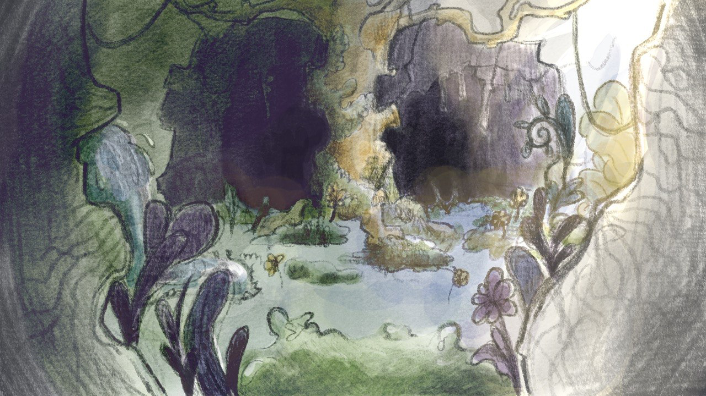
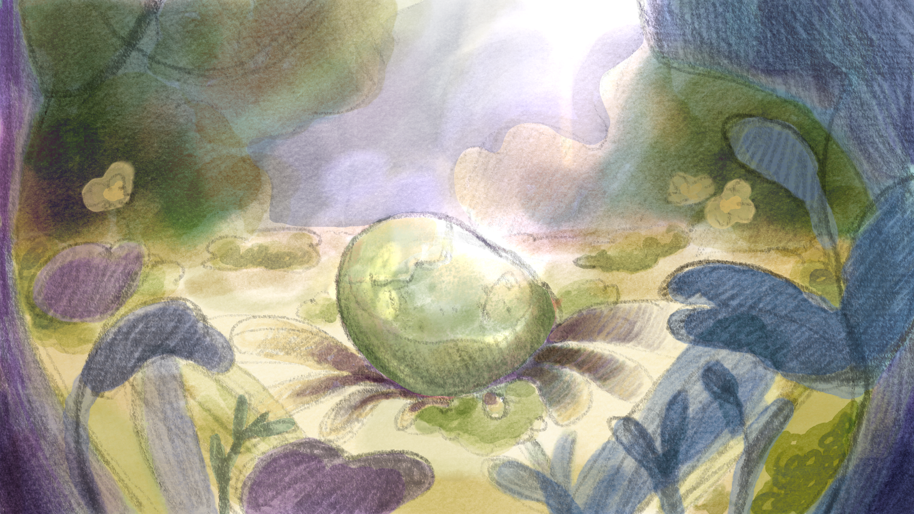

# Python Text Adventure Engine

Un'avventura testuale in Python con **interfaccia grafica integrata** (tkinter + Pillow).
Una sola finestra: il disegno della scena in alto, sotto il testo, le scelte del momento, i comandi e il prompt.

Il progetto è nato durante il corso **Generation Italy** come esercizio tecnico e sta crescendo come piccolo mondo illustrato, **Taz**, dove ogni scena passa prima per un acquerello fatto a mano da Daniela e poi entra nel gioco.

## I disegni

La grotta del risveglio — la prima scena del gioco.



L'avventurina, l'oggetto che si trova nella prima scena.



## Avvio

```bash
pip install -r requirements.txt
python main.py
```

Si apre la finestra, scrivi il nome del personaggio, parte l'incipit e ti trovi al bivio davanti alla grotta del risveglio.

Comandi globali disponibili in qualunque scena: `inventario`, `personaggio`, `ispeziona`, `prendi`, `salva`, `esci`.
Quando ci sono oggetti nella scena, basta scriverne il nome al prompt per aprire il loro menu di interazione (`ispeziona` / `prendi` / `esci`).

## Struttura

```
engine/   logica del motore (personaggio, comandi, GUI, input)
models/   oggetti del gioco
scenes/   scene e flusso narrativo
disegni/  illustrazioni ad acquerello — fatte a mano da Daniela
main.py   entry point
```

## Le scene non ancora illustrate

Dove un disegno manca, la finestra mostra un rettangolo nero con scritto *(scena ancora da disegnare)*. È un promemoria visivo: a ogni nuovo acquerello che arriva, una parte del nero sparisce.

## Crediti

- **Codice**: Roberto, Junior Python Developer formato in Generation Italy.
- **Illustrazioni**: **Daniela**, la mia ragazza. Tutti i disegni sono ad acquerello, fatti a mano per il mondo di Taz.

## Licenza

MIT.

---

# English version

> *A full English translation will be provided in a later update. The summary below is intentionally short and professional, for international visitors.*

## Python Text Adventure Engine

A Python text adventure with an **integrated GUI** (tkinter + Pillow). One single window: the scene illustration on top, scene text below, current choices, global commands and a command prompt.

The project started during the **Generation Italy** course as a technical exercise and is growing into a small illustrated world, **Taz**: every scene begins as a hand-painted watercolour by Daniela and only then enters the game.

### Run

```bash
pip install -r requirements.txt
python main.py
```

The window opens, you type your character's name, the intro plays and you find yourself at a fork in front of the awakening cave.

Global commands available in every scene: `inventario` (inventory), `personaggio` (character), `ispeziona` (inspect), `prendi` (take), `salva` (save), `esci` (exit).
When the scene contains items, typing their name at the prompt opens their interaction menu (`ispeziona` / `prendi` / `esci`).

### Project structure

```
engine/   engine logic (character, commands, GUI, input)
models/   game objects
scenes/   scenes and narrative flow
disegni/  hand-painted watercolour illustrations by Daniela
main.py   entry point
```

### Scenes not yet illustrated

Where a drawing is missing, the window shows a black rectangle labelled *"(scena ancora da disegnare)"* — "scene not drawn yet". It's a visual reminder: every new watercolour makes a part of that black disappear.

### Credits

- **Code**: Roberto, Junior Python Developer trained at Generation Italy.
- **Illustrations**: **Daniela**, my girlfriend. Every illustration is a hand-painted watercolour made specifically for the world of Taz.

### License

MIT.
